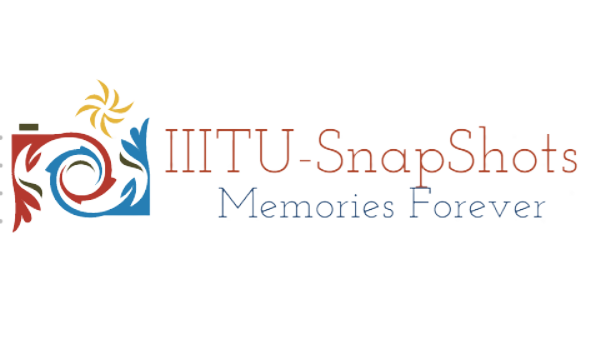
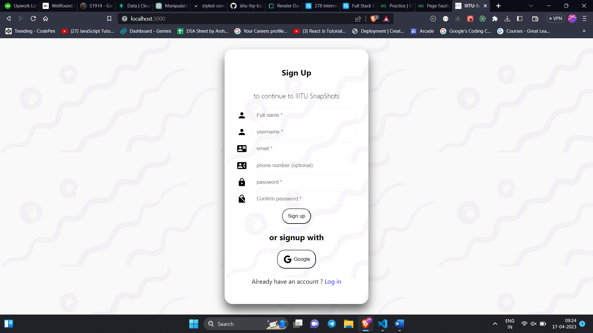
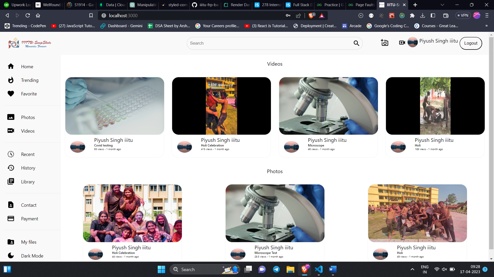
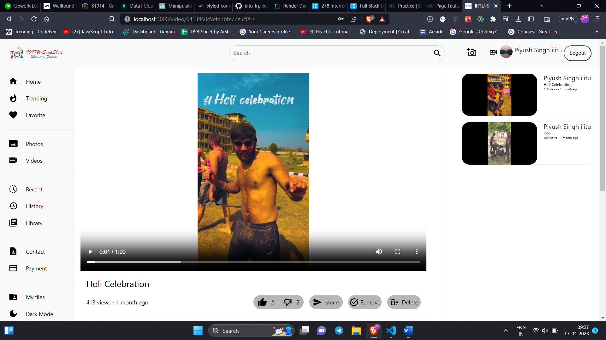
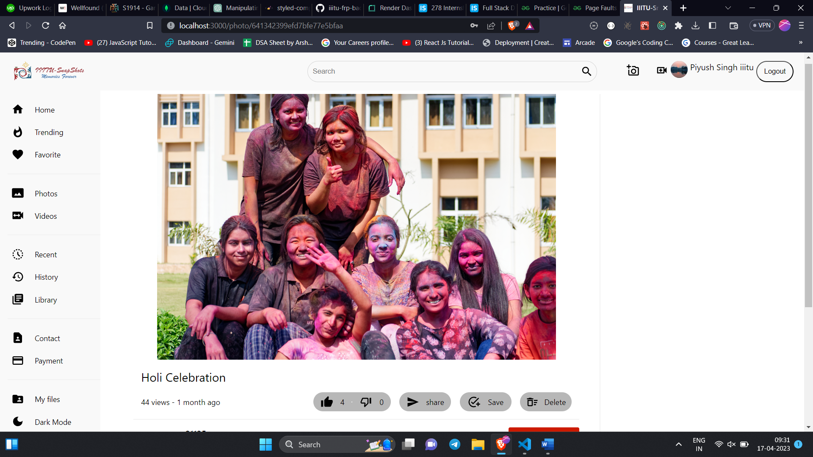
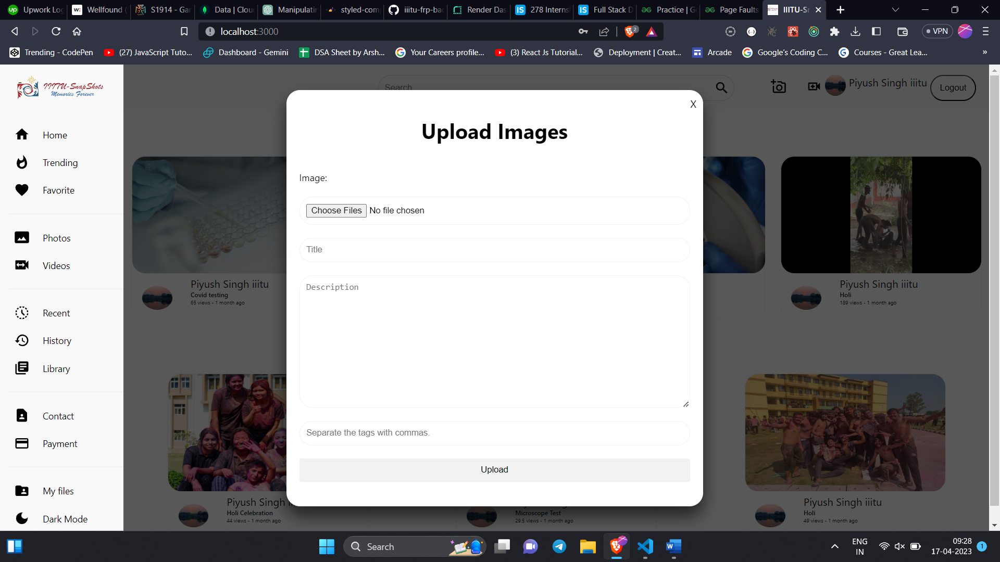
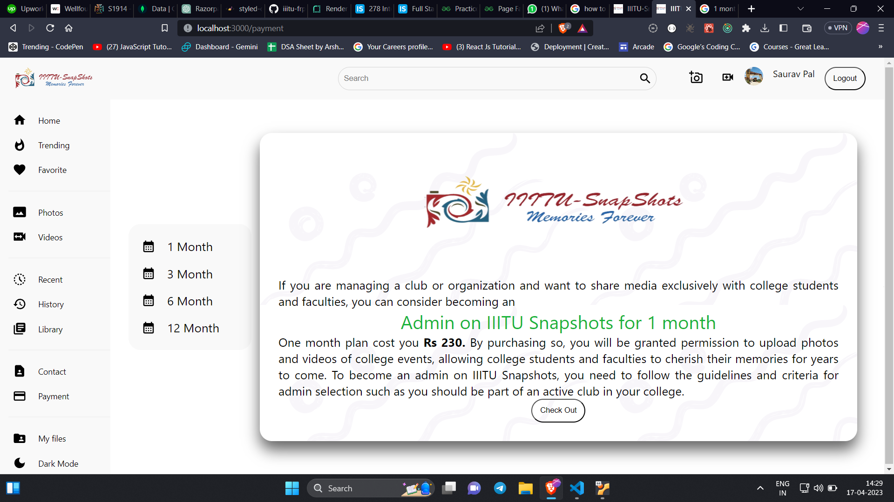

# IIITU Snapshot

IIITU Snapshot is a web app that allows users to relive and celebrate their college memories through photos and videos. Powered by MongoDB, Firebase, Express.js, Node.js, and React.js, this platform offers a seamless way to capture and share cherished moments from your college journey.

## Features

- Upload and manage photos and videos to capture memorable moments.
- Like, comment, share, and download media to engage with your college community.
- Exclusive access for college club members to purchase admin plans and enhance the platform.
- Secure and personalized environment - users can only access media from their own college.
- Immersive user experience with a responsive and intuitive design.

## Screenshots

_Authenticate yourself._

_Explore the vibrant memories of campus festivals._

_Like, comment, and share your favorite moments._

_Like, comment, and share your favorite moments._

_Add media if you are admin._

_Purchase plans to become admin._

## Use

For using it go to the deployment link :- https://iiitu-snapshots-frontend.vercel.app/

## Contributing

We welcome contributions from the community! If you'd like to contribute to IIITU Snapshot, please follow these steps:

1. Fork the repository.
2. Create a new branch: `git checkout -b feature/your-feature-name`
3. Commit your changes: `git commit -m "Add your feature"`
4. Push to the branch: `git push origin feature/your-feature-name`
5. Open a pull request.

## License

This project is licensed under the [MIT License](LICENSE).

---

Feel free to explore and contribute to IIITU Snapshot. Capture the magic of your college memories and keep them alive for generations to come!
